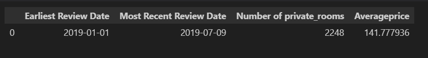

# Airbnb Market trends
### This project analyzes New York City's Airbnb market using Python and Tableau to compare market changes from 2019, 2023, and 2024.

New York City, one of the most-visited cities in the world. There are many Airbnb listings in New York City to meet the high demand for temporary lodging for travelers, which can be anywhere between a few nights to many months. In this project, we will take a closer look at the New York Airbnb market in 2019 and how it compares to 2023 and 2024.

### Aims And Objectives
We will examine the following questions for the year 2019 and observe how the market trends have evolved over time.

1. What are the dates of the earliest and most recent reviews? 
2. How many of the listings are private rooms? 
3. What is the average listing price?
4. Combine the new variables into one DataFrame called review_dates with four columns in the following order: 
   first_reviewed, last_reviewed,    nb_private_rooms, and avg_price.
5. What has change between 2019 and 2023 in terms of prices, room type and any other information
## Answers

# AZURE SYNAPSE INGESTION
